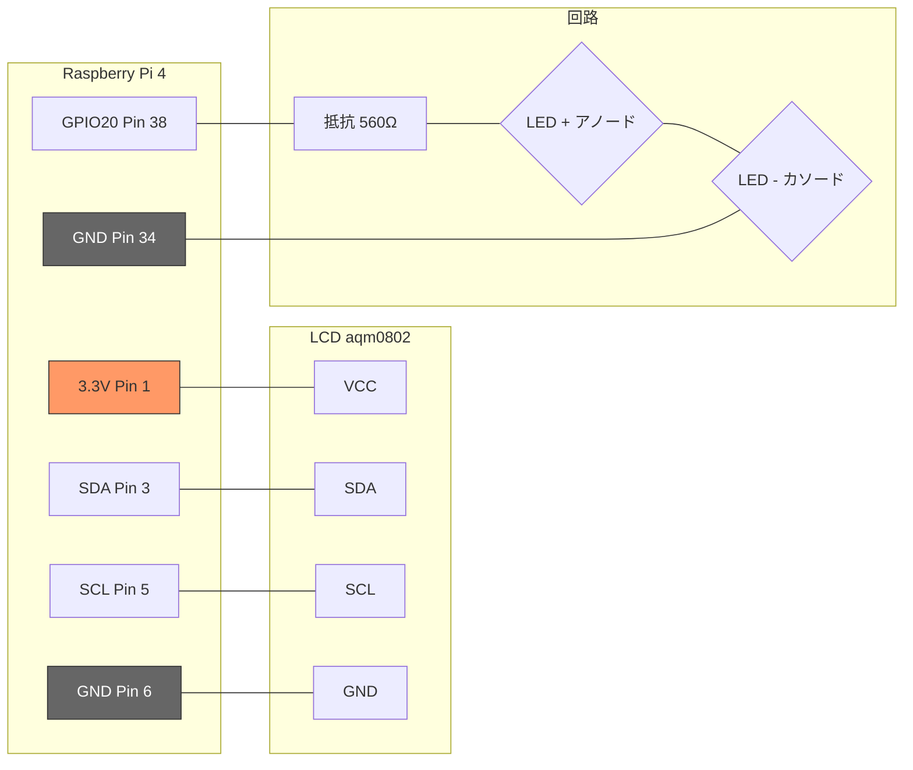
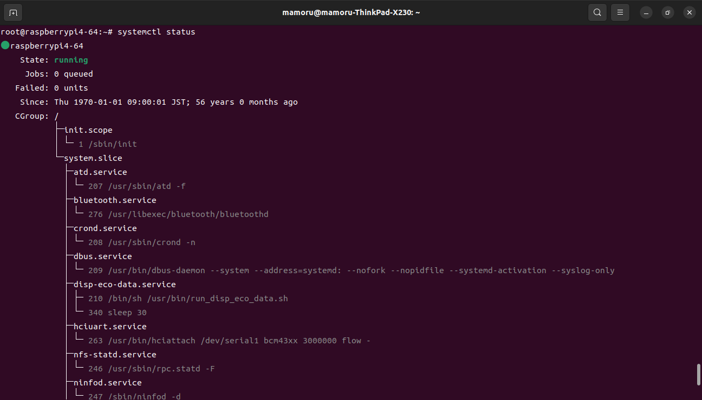
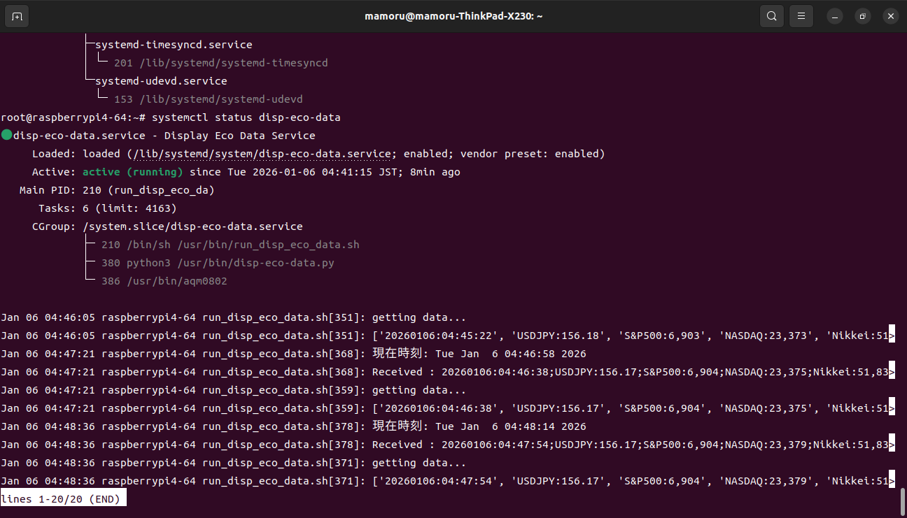

# Yocto環境 で ラズベリーパイ４用アプリ 開発

## 1 目的
YoctoProjectを利用しラズベリーパイ４のアプリやカーネルドライバを開発する環境を構築する<br>
ラズベリーパイ４に接続したLCDに、Webから取得した経済指標値を表示するアプリを作成する<br>
動作する様子は、https://www.youtube.com/shorts/1DS9vUlRqi0 を参照<br>

## 2 開発環境

### 2.1 開発PC
YoctoProject(https://www.yoctoproject.org/) を使用する<br>
Yoctoのバージョンは kirkstone を使用する<br>
開発PCは ノートPC lenovo X230 を使用した(低性能のためフルビルドで6時間程度)<br> 
開発PCのOSは ubuntu 22.04 (Yoctoが指定するもの) を使用する<br> 
開発PCは Wi-Fiルータを経由しインターネットに接続する<br>

### 2.2 ターゲット
ラズベリーパイ４(以降ラズパイ)を使用する<br>
LCDは、2行☓8文字のLCD表示機(AQM0802A)を用いラズパイのI2Cポートに接続する<br>
バックライトは、LEDを用いラズパイのGPIOポート20に接続する<br>
その他ブレッドボード、電線、抵抗等を用いた<br>

#### 2.2.1 ラズパイとLCD、ラズパイとLEDの接続
接続は以下の通り<br>
<div style="width: 600px; margin: auto;">


  図１：接続図
</div>

## 3 機能
ラズパイは起動時に以下を行う<br>
・Wi-Fiルータに接続する<br>
・インタフェース wlan0 のIPアドレスを 192.168.11.6 に固定する(DHCPにすることも可)<br>
・日本国内の公開NTPサーバーに接続し時刻を同期する<br>
・アプリケーションを起動する<br>
　アプリはPythonプログラム(disp-eco-data.py)で、経済指標値をWebスクレイピングし、C言語アプリドライバ(aqm0802.c)を介し LCDに表示する<br>
　経済指標値：ドル円、S&P500、NASDAQ、日経平均、10年米国債利回り、5年米国債利回り、金価格、ビットコイン(ドル建て)、イーサリアム（ドル建て)<br>
起動後は、周期的にWebスクレイピングとLCD表示をする<br>
LCDに経済指標値を表示する際LEDを点灯し、表示終了後LEDを消灯する<br>
任意の端末からラズパイにSSH接続し、状態確認や処理実行が可能<br>
<div style="text-align: center;">
  <br>
  図２：状態確認画面
</div>
<div style="text-align: center;">
  <br>
  図３：動作確認画面
</div>

## 4 環境構築手順
開発PC内の任意の位置にプロジェクトフォルダを作り、その中に Yoctoに関するファイル類 をクローンする<br>
そしてユーザ独自のフォルダを作り、レシピ(Yoctoが扱う手順)やソースコードを格納する<br>
Yoctoツール BitBake を用いて、ラズパイで動作させるイメージをビルドする<br>
以下に手順の詳細を記す

### 4.1 プロジェクトフォルダ作成
```
mkdir yocto_rpi
cd yocto_rpi
```
※yocto_rpi は任意、以下pathの記載はこのフォルダをベースとする


### 4.2 Poky をクローン（Yoctoのコアレイヤー）`
```
git clone -b kirkstone git://git.yoctoproject.org/poky.git
```
### 4.3 meta-openembedded をクローン（追加のレシピとレイヤー）
```
git clone -b kirkstone git://git.openembedded.org/meta-openembedded
```
### 4.4 meta-raspberrypi をクローン（Raspberry Pi BSP）
```
git clone -b kirkstone git://git.yoctoproject.org/meta-raspberrypi
```
ここまではクローン後、内容はいじらない

### 4.5 ユーザ独自のレイヤーを作成
```
mkdir meta-custom
```
本フォルダの内容はGitHub(このファイルと同じ階層に配置)を参照

### 4.6 構成ファイルの種類
.conf は Yocto Projectにおける設定ファイル<br>
.bb は レシピ(自作のスクリプトやサービスファイルをイメージに含めるための「設計図」)<br>
.bbappend は レシピ拡張(他のレイヤーにある既存のレシピの設定を、元のレシピを直接書き換えずに変更するために使う)<br>
.service は systemd ユニットファイル(Yocto環境で自作アプリを自動起動させるため使う)<br>
.network は systemd-networkd というネットワーク管理サービスの設定ファイル<br>
各ファイルの内容は 5 構成ファイルの内容 を参照<br>

### 4.7 フォルダの構造

#### 4.7.1 yocto_rpi/build/conf
注文書・環境設定(特定のビルドに対する 「個別設定」 を行う場所を定義する)
```
.
├── bblayers.conf
├── local.conf
└── templateconf.cfg
```
#### 4.7.2 yocto_rpi/meta-custom
設計図・資産(「何を作るか」「どう作るか」という手順を定義する)
```
.
├── conf
│   └── layer.conf
├── recipes-app
│   └── disp-eco-data
│       ├── disp-eco-data_1.0.bb
│       └── files
│           ├── Makefile
│           ├── aqm0802.c
│           ├── disp-eco-data.py
│           ├── disp-eco-data.service
│           └── run_disp_eco_data.sh
├── recipes-connectivity
│   ├── resolvconf-static
│   │   ├── files
│   │   │   └── resolv.conf
│   │   └── resolvconf-static_1.0.bb
│   └── wpa-supplicant
│       ├── files
│       │   ├── wpa_supplicant.conf
│       │   └── wpa_supplicant@.service
│       └── wpa-supplicant_%.bbappend
├── recipes-core
│   ├── images
│   │   └── cunstom-image.bb
│   └── systemd
│       ├── files
│       │   ├── 20-wlan0.network
│       │   ├── 30-eth0.network
│       │   └── rpi-modules.conf
│       └── systemd_%.bbappend
├── recipes-extended
│   ├── my-settings
│   │   ├── files
│   │   │   └── rpi-init.service
│   │   └── my-settings.bb
│   ├── ntp
│   │   ├── files
│   │   │   └── ntp.conf
│   │   └── ntp_%.bbappend
│   └── ntp-once
│       ├── files
│       │   └── ntp-once.service
│       └── ntp-once_1.0.bb
├── recipes-images
│   └── core-image
│       └── core-image-full-cmdline.bbappend
├── recipes-kernel
│   ├── linux-firmware
│   │   ├── files
│   │   │   ├── brcmfmac43455-sdio.bin
│   │   │   ├── brcmfmac43455-sdio.raspberrypi,4-model-b.bin
│   │   │   └── brcmfmac43455-sdio.raspberrypi,4-model-b.txt
│   │   └── linux-firmware_%.bbappend
│   └── test-module
│       ├── files
│       │   ├── Makefile
│       │   └── test-module.c
│       └── test-module_1.0.bb
└── recipes-python
    ├── multitasking
    │   └── python3-multitasking_0.0.11.bb
    ├── python-init
    │   ├── files
    │   │   ├── python-env-setup.service
    │   │   └── setup-python-env.sh
    │   └── python-init_1.0.bb
    ├── python3-frozendict
    │   └── python3-frozendict.bb
    ├── python3-peewee
    │   └── python3-peewee_3.17.1.bb
    ├── python3-platformdirs
    │   └── python3-platformdirs_2.6.2.bb
    └── yfinance
        └── python3-yfinance_0.2.40.bb
```
## 4.8 ビルドする
/home/user/yocto_rpi/　で以下を実行する
```
source poky/oe-init-build-env build
bitbake core-image-full-cmdline
```

## 4.9 イメージをマイクロSDカードに書き込む
開発PCがマイクロSDカードを /dev/mmcblk0 として認識している状態で以下を実行する<br>
または書き込みツール(BalenaEtcher等)を利用する<br>
コマンド内の"user"は任意<br>
```
rm core-image-full-cmdline-raspberrypi4-64.wic
cp /home/user/yocto_rpi/build/tmp/deploy/images/raspberrypi4-64/core* .
bzip2 -d core-image-full-cmdline-raspberrypi4-64.wic.bz2
sudo dd if=/dev/zero of=/dev/mmcblk0 bs=1M count=1
sudo dd if=core-image-full-cmdline-raspberrypi4-64.wic of=/dev/mmcblk0 bs=4M status=progress conv=fsync
```
マイクロSDカードを開発PCから抜く

## 4.10 実行
マイクロSDカードをラズパイに挿す<br>
ラズパイに電源を供給する<br>
起動後しばらくするとLCDに経済指標値が表示される<br>
開発PCのターミナルで ssh root@192.168.11.6 を実行すると、ラズパイにSSH接続し状態の確認や各処理の実行が可能となる

## 5 構成ファイルの内容
ファイルを格納するpathは 4.1 プロジェクトフォルダ作成 で設定した場所(本ケースでは"yocto_rpi")がベースになる

### 5.1 build/conf(個人の開発環境に依存するもの)
注文書・環境設定(特定のビルドに対する 「個別設定」 を行う場所を定義する)

#### 5.1.1 bblayers.conf
path:yocto_rpi/build/conf<br>
BitBakeが検索を試みるレイヤーのリスト<br>
以下を記す<br>
定義内の"user"は任意<br>
```
POKY_BBLAYERS_CONF_VERSION = "2"

BBPATH = "${TOPDIR}"
BBFILES ?= ""

BBLAYERS ?= " \
  /home/user/yocto_rpi/poky/meta \
  /home/user/yocto_rpi/poky/meta-poky \
  /home/user/yocto_rpi/poky/meta-yocto-bsp \
  /home/user/yocto_rpi/meta-openembedded/meta-oe \
  /home/user/yocto_rpi/meta-openembedded/meta-python \
  /home/user/yocto_rpi/meta-openembedded/meta-networking \
  /home/user/yocto_rpi/meta-openembedded/meta-multimedia \
  /home/user/yocto_rpi/meta-custom \
  /home/user/yocto_rpi/meta-raspberrypi \
  " 
```
#### 5.1.2 local.conf 
path:yocto_rpi/build/conf<br>
Yocto Projectが使用するローカルユーザ用設定ファイル<br>
以下を変更・追記する<br>
```
MACHINE = "raspberrypi4-64"

CONF_VERSION = "2"
EXTRA_IMAGE_FEATURES += " \
  ssh-server-openssh \
  debug-tweaks \
  "
IMAGE_FEATURES += "tools-debug"
DISTRO_FEATURES_BACKFILL_CONSIDERED += "sysvinit"
PACKAGECONFIG:pn-systemd = "networkd utmp"
DISTRO_FEATURES:append = " systemd"
VIRTUAL-RUNTIME_init_manager = "systemd"
VIRTUAL-RUNTIME_initscripts = "systemd-compat-units"
CORE_IMAGE_EXTRA_INSTALL += " openssh openssh-sshd xz i2c-tools "
IMAGE_INSTALL:append = " \
                         python3-pip python3-certifi python3-setuptools \
                         python3-sqlite3 python3-modules python-init \
                       "
IMAGE_INSTALL:append = " \
                         wpa-supplicant systemd crda linux-firmware \
                         libgpiod libgpiod-dev libgpiod-tools \
                         resolvconf-static ntp ntp-once \
                         usbutils pciutils kernel-modules rpi-module-loader \
                         disp-eco-data \
                         test-module \
                       "
BB_NUMBER_THREADS = "2"
PARALLEL_MAKE = "-j 2"
RPI_EXTRA_CONFIG:append = " \n dtparam=i2c_vc=on \n dtparam=i2c_arm=on \n dtoverlay=i2c-dev"
INIT_MANAGER = "systemd"
SYSTEMD_AUTO_ENABLE:pn-systemd-networkd = "enable"
PACKAGECONFIG:remove:pn-glibc = "nscd"
PACKAGECONFIG:append:pn-systemd = " timesyncd"
SYSTEMD_AUTO_ENABLE:pn-ntp = "enable"
SYSTEMD_AUTO_ENABLE:pn-disp-eco-data = "enable"
IMAGE_INSTALL:append = " tzdata"
DEFAULT_TIMEZONE = "Asia/Tokyo"
```

### 5.2 meta-custom(プロジェクト固有の資産)
設計図・資産(「何を作るか」「どう作るか」という手順を定義する)

#### 5.2.1 rpi-modules.conf
path:yocto_rpi/meta-custom/recipes-core/systemd/files<br>
ロードするドライバモジュール brcmfmac と i2c-dev を記す

#### 5.2.2 wpa_supplicant.conf
path:yocto_rpi/meta-custom/recipes-connectivity/wpa-supplicant/files<br>
wlan0経由でのWi-Fi接続先を記す

#### 5.2.3 20-wlan0.network
path:yocto_rpi/meta-custom/recipes-core/systemd/files<br>
インタフェース wlan0 のipアドレスを記す

#### 5.2.4 ntp.conf
path:yocto_rpi/meta-custom/recipes-extended/ntp/files<br>
ntpサーバのURIを記す

#### 5.2.5 ntp-once.service
path:yocto_rpi/meta-custom/recipes-extended/ntp-once/files<br>
起動時の時刻同期処理を記す

#### 5.2.6 rpi-init.service
path:yocto_rpi/meta-custom/recipes-extended/my-settings/files<br>
モジュールの読み込みとサービスの有効化を記す

#### 5.2.7 disp-eco-data.py
path:yocto_rpi/meta-custom/recipes-app/disp-eco-data/files<br>
本ファイルがユーザアプリケーション<br>
Webサイト yahooファイナンス より各指標値を取得し、LCD表示処理に渡す<br>
各指標値の内容は以下の通り
|シンボル|	正式名称	|意味・内容|
| :----- | :--------- | :------- |
|JPY=X|	USD/JPY|	ドル円の為替レート。1ドルが何円かを表す|
|^GSPC|	S&P 500	|S&P 500 指数。米国株の主要500社の時価総額加重平均。米国市場全体の調子を見る指標|
|^IXIC|	NASDAQ Composite|ナスダック総合指数。テック企業（Apple, Google等）が多い市場の指標|
|^N225|	Nikkei 225|日経平均株価。日本を代表する225銘柄の平均株価|
|^TNX	|10-Year Treasury Note|米国債10年物利回り。長期金利の代表。株価や住宅ローンに大きな影響を与えます|
|^FVX |5-Year Treasury Note|米国債5年物利回り|
|GC=F	|Gold Futures	|金（ゴールド）先物。安全資産とされる金の価格|
|BTC-USD|Bitcoin USD|ビットコイン（ドル建て）。代表的な暗号資産の価格|
|ETH-USD|Ethereum USD|イーサリアム（ドル建て）。時価総額2位の暗号資産|

##### 5.2.7.1 pythonプログラム仕様 
`def get_financial_data():`<br>
　yahoo financeから”ドル円、S&P500、NASDAQ、日経平均、10年米国債利回り、5年米国債利回り、金価格、ビットコイン(ドル建て)、イーサリアム（ドル建て)”を取得する<br>
　LCDに表示するデータを組み立てる際、先頭に年月日時分を格納する<br>
`def send_message(message):`<br>
　pipeを利用してC言語プログラムへLCDに表示するデータを伝達する<br>
`if __name__ == "__main__":`<br>
　上記処理を実行する　<br>

#### 5.2.8 disp-eco-data.service
path:yocto_rpi/meta-custom/recipes-app/disp-eco-data/files<br>
WebスクレイピングとLCD表示を実行するシェルを登録する

#### 5.2.9 aqm0802.c 
path:yocto_rpi/meta-custom/recipes-app/disp-eco-data/files<br>
引数で渡される文字列データをLCDに表示するLinuxアプリドライバ
##### 5.2.9.1 C言語プログラム仕様(LCD制御に関するもの)
`void lcd_write_byte(int fd, unsigned char data, unsigned char mode)`<br>
　I2C経由に1バイト出力する<br>
`void lcd_write_string(int fd, const char *str)`<br>
　LCDに文字列を表示する。上記1バイト出力関数を呼び出す<br>
`void lcd_clr(int fd)`<br>
  LCDをクリアする<br>
`void lcd_line_select(int fd,int line)`<br>
　LCDの表示行を指定する<br>
`void lcd_init(int fd)`<br>
　LCD(AQM0802A)を初期化する<br>
　　機能セット: 8ビットモード、2行表示、 拡張命令セット、内部発振器周波数設定、コントラスト設定、電源/フォロワ制御<br>
　　機能セット: 基本命令セット、表示制御: 表示ON、カーソルOFF、点滅OFF、画面クリア<br>
`int main()`<br>
　gpioを初期化する<br>
　i2c用デバイスファイルをオープンする<br>
　ライトを点灯する<br>
　スクレイピング処理から伝達された経済指標データを１項目づつLCDに表示する<br>
　ライトを消灯する<br>
##### 5.2.9.2 C言語プログラム仕様(LED制御に関するもの)
`int gpio_init()`<br>
　GPIODライブラリを呼び出しGPIOラインの初期化をする<br>
`void gpio_cleanup()`<br>
　GPIOラインを開放する<br>
`void light_ctrl(char onoff)`<br>
　ラズパイGPIO(20ピン)にON/OFFを出力する<br>

#### 5.2.10 test-module.c
path:yocto_rpi/meta-custom/recipes-kernel/test-module/files<br>
テスト用カーネルドライバ(insmod rmmod 時ログ出力するだけ[今後の拡張用])<br>

以上